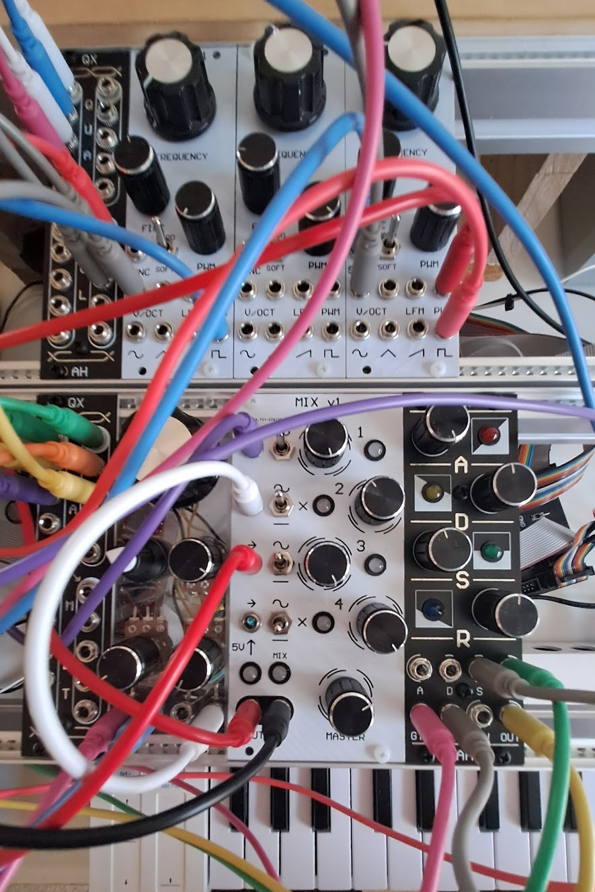

# Modular Synthesizer Documentation

This repo is a documentation of my DIY modular syntheszier project. It contains completed and WIP module documentation, as well as notes and ideas for future modules. The project was started in October 2021 and is still in progress as of March 2024.

 

# Components

## Cases

 - [Briefcase](#briefcase)

## Completed Modules

- [VCO](#voltage-controlled-oscillator-vco)
- [Mixer](#mixer)
- [Quad Multiple](#quad-multiple-qx)
- [PSU](#power-supply-psu)
- [ADSR Digital](#adsr-digital)
- [XLR Output](#xlr-output-xo)
- [Clock Divider](#clock-divider-cd)
- [Touch Pads](#touch-pads-tp)
- [Dual Headphone Output](#dual-headphone-output-dho)

## Old Modules

 - [VCO](#vco)
 - [Case + PSU](#dual-vca--lfo)
 - [Dual VCA + LFO](#dual-vca--lfo)
 - [ADSR + Sequencer](#adsr--sequencer)

## Work In Progress

- Steiner Filter
- Quad VCA
- Kick Drum
- Touch Triggers

## Gallery

- [Misc Photos](#misc-photos)

 

# Briefcase

To make the synth easier to move and store, a 168HP case was made from two rows of 84HP rail. The rails were mounted into a case from [Bunnings](https://www.bunnings.com.au/craftright-45cm-aluminium-tool-case_p0331036) that is coincidentally exactly the right inner width for the rails.

The rails are held in using M4 bolts with nyloc nuts on the inside. These 8 nuts provide sufficient support for the rails and results in a very strong frame. The top speaker bar is a piece of spotted gum with linseed oil. It is supported by an MDF frame with the powersupply attached. 

# Voltage Controlled Oscillator (VCO)

The VCO is the heart of the synth and produces waves at a frequency determined by the input voltage. It follows the volt per octave (v/oct) conviention whereby the frequency of the oscillator will double (+1 octave) for every volt input into the v/oct input.

The VCO is based on the AS3340, an all-in-one osillator chip that produces a square, saw and triangle wave of the set frequency. The schematic is based on the [Kassutronics VCO](https://github.com/kassu/kassutronics/tree/master/documentation/VCO%203340).

The [first PCB revision](VCO/VCOv1.pdf) was my first time using [Altium Designer](https://www.altium.com/altium-designer), and also my first time ordering a custom pcb through [JLCPCB](https://jlcpcb.com/) and there were quite a few mistakes. The largest of which was the OP amps being flipped such that the inverting and non-inverting inputs were reversed. After hacking together a working prototype, this first revision was retired and I redesigned it for v2.

For v2 I changed a few things.

- Much higher component density
- Blue silkscreen
- Smaller capacitor footprints

While the v2 PCB was arriving, I made a faceplate for the VCO. This was also designed in Altium as a PCB, then fabricated as a single sided aluminium pcb. Making it as an aluminium PCB gives it much more rigidity than an FR4 board, while still having a solder mask, copper layer and silkscreen.

I put some patterning on the copper layer to give the panel some texture, while using the silkscreen to display labels for the potentiometers and inputs/outputs. As the minimum order from JLC is 5 boards, I decided to assemble 4 of them to allow for more voices and/or chords.

# Mixer
*writeup coming soon!*

# Quad Multiple (QX)
The Quad Multiple is a 4-way or 8-way buffer for multiplying signals. Each input, denoted by the white circle, is multiplied into the 4 outputs below it. The top two inputs are also the default input for the opposite bottom multipliers. In this state, the system acts as dual 8-way multipliers. When an input is inserted into the lower input jacks, the circuit is broken and they will then act as separate 4-way multipliers.

# Power Supply (PSU)
*writeup coming soon!*
 

Revision 1.1 - added half-wave rectifier with RC filter for AC input LED (yellow) to remove flicker. Squared corners to denote revision.

# XLR Output (XO)
*writeup coming soon!*

# ADSR Digital
The ADSR Digital is a 555 timer based ADSR with outputs to indicate which stage of the envelope is currently active. The core of the design comes from the [Kassu ADSR](https://kassu2000.blogspot.com/2015/05/precision-adsr.html) which is based on the [Yusynth ADSR](http://yusynth.net/Modular/EN/ADSR/index_new.html).

The envelope is then passed through several opamps which act as summing amps and comparators to determine which stage of the envelope.

A retrigger input was also added that allows the attack phase to be restarted as long as the gate is active.

 

# Clock Divider (CD)
*writeup coming soon!*
 

# Touch Pads (TP)

The touch pads use a MOSFET circuit that detects a press using the conductivity of skin.

Despite the high resistance of skin, it is enough to dominate in a voltage divider against the 22M and pull the gate of the mosfet low. This causes the MOSFET 

# Dual Headphone Output (DHO)

This module provides two headphone outputs with two input sources. Each driver can select from either the master or cue bus with a switch at the bottom of the module. This allows for the two drivers to be used on completely different sources, or in a more tradition DJ mixer setup with a master and cue bus.

# Old Modules

These modules were built on breadboards for rapid prototyping, beforing being made semi-permanent using stripboard. I cut some scrap 2mm aluminium into a front panel and drilled out holes for the pots and jacks. The text is written on with sharpie.

## VCO

Breadboarded VCO to test the AS3340 before converting it to a stripboard layout using [DIY Layout Creator](http://diy-fever.com/software/diylc/).

The boards were then stacked and assembled behind the aluminium faceplate.

## Case + PSU

I threw together a simple wooden rack using spare wood i had from an old set of drawers. A PSU and busboard was assembled from some stripboard and attached into the bottom of the case to power the synth.

## Dual VCA + LFO

After the VCO, I built a dual VCA and LFO to allow for an envelope on the sound. The documentation here is limited due to these modules being built rapidly within a few days.

## ADSR + Sequencer

The fourth addition was an ADSR to generate an envelope for the VCA. Clear acrylic was used as it is a lot easier to work with than the 2mm aluminium plate. The 5th module is just a front for a future VCF. The breadboard is a 16 step sequencer that is yet to be made into a final module.

# Misc Photos

