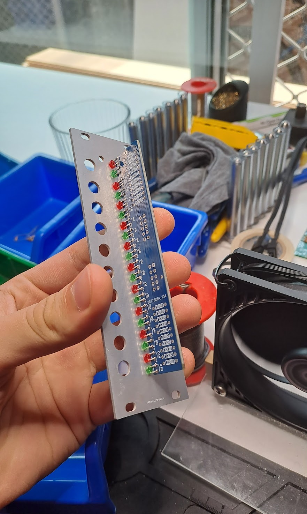

# Modular Synthesizer Documentation

This repo is a documentation of my DIY modular syntheszier project. It contains completed and WIP module documentation, as well as notes and ideas for future modules.

# Modules

## Completed Modules

- [VCO](#voltage-controlled-oscillator-vco)
- [Mixer](#mixer)
- [Quad Multiple](#quad-multiple-qx)
- [XLR Output](#xlr-output-xo)
- [Clock Divider](#clock-divider-cd)

## Work In Progress

- Steiner Filter
- VCA
- Kick Drum
- Touch Triggers

 

# Voltage Controlled Oscillator (VCO)

The VCO is the heart of the synth and produces waves at a frequency determined by the input voltage. It follows the volt per octave (v/oct) conviention whereby the frequency of the oscillator will double (+1 octave) for every volt input into the v/oct input.

The VCO is based on the AS3340, an all-in-one osillator chip that produces a square, saw and triangle wave of the set frequency. The schematic is based on the [Kassutronics VCO](https://github.com/kassu/kassutronics/tree/master/documentation/VCO%203340).

The [first PCB revision](VCO/VCOv1.pdf) was my first time using [Altium Designer](https://www.altium.com/altium-designer), and also my first time ordering a custom pcb through [JLCPCB](https://jlcpcb.com/) and there were quite a few mistakes. The largest of which was the OP amps being flipped such that the inverting and non-inverting inputs were reversed. After hacking together a working prototype, this first revision was retired and I redesigned it for v2.

For v2 I changed a few things.

- Much higher component density
- Blue silkscreen
- Smaller capacitor footprints

While the v2 PCB was arriving, I made a faceplate for the VCO. This was also designed in Altium as a PCB, then fabricated as a single sided aluminium pcb. Making it as an aluminium PCB gives it much more rigidity than an FR4 board, while still having a solder mask, copper layer and silkscreen.

I put some patterning on the copper layer to give the panel some texture, while using the silkscreen to display labels for the potentiometers and inputs/outputs. As the minimum order from JLC is 5 boards, I decided assembled 4 of them.

# Mixer
*writeup coming soon!*

# Quad Multiple (QX)
*writeup coming soon!*

# XLR Output (XO)
*writeup coming soon!*

|  |  |  |  |
| - | - | - | - |
| a | b | c | d |

| a | b |
| - | - |
| c | d |

# Clock Divider (CD)
*writeup coming soon!*

